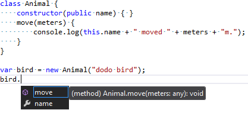
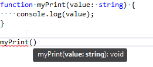
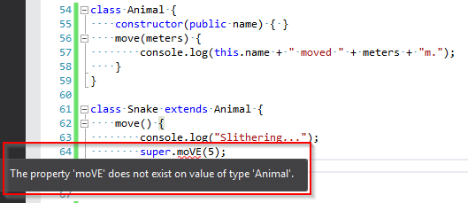
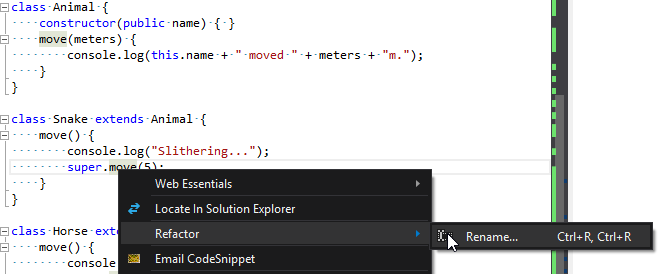
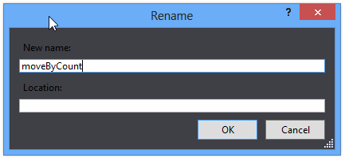
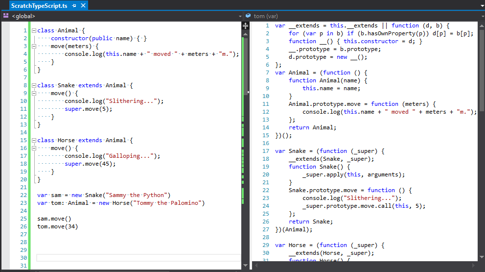
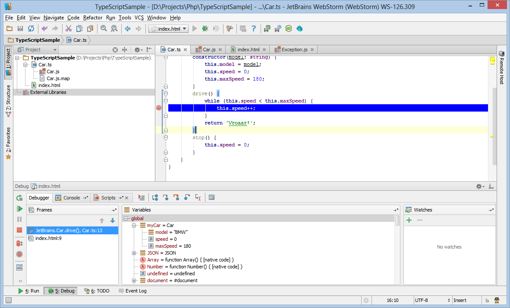
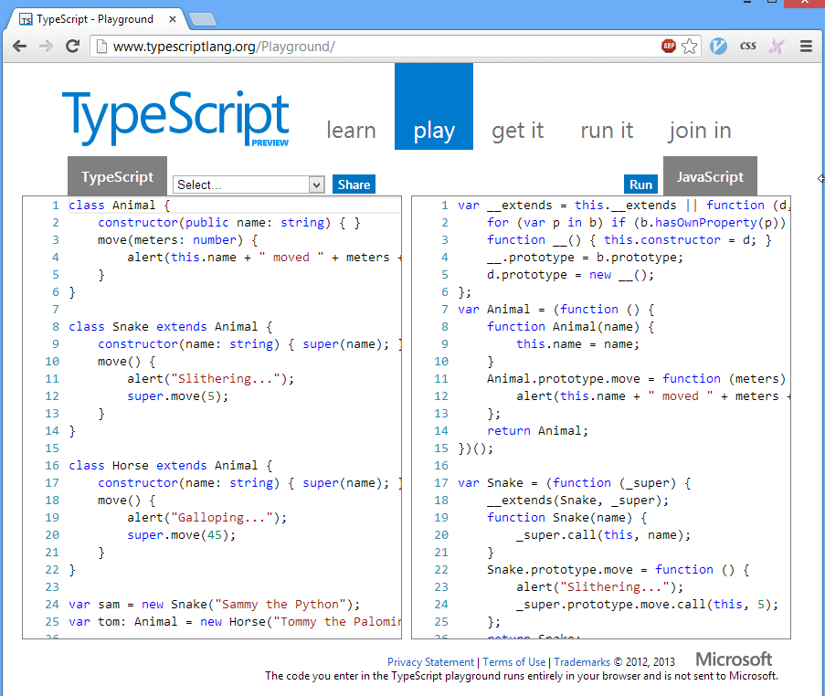
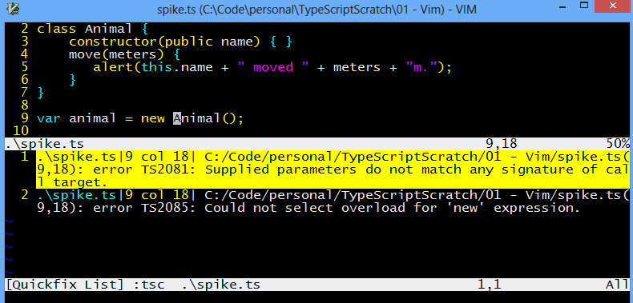

TODO:

- turn off whitespace in Visual Studio

- Search for other TODO's and fix
- Describe some special syntax of the language
- Answer some questions
    - Who created it?
    - Why would I use it?
    - How will it help me?
- Talk about the compiler
    - some of the command line options
- Walk through converting an existing project to TypeScript

===

# TypeScript 
### Presented By
# Jason Jarrett
> * Twitter: [@staxmanade](https://twitter.com/staxmanade)
> * Blog: [http://elegantcode.com](http://elegantcode.com)
> * Some Code: [http://github.com/staxmanade](http://github.com/staxmanade)
> * Work at: [Vertigo](http://vertigo.com)

===

### TypeScript

# What?

==

## The Language

The below JavaScript

    function log(value) {
        console.log(value);
    }
    
    log("Hello World");

is also TypeScript

Note:
- It's just JavaScript - sort of -(Superset)
- ES6
- Static annotations

==

### TypeScript

# Why?

Note:
- Difficult to structure JavaScript at scale.
- Prevalence of JavaScript

==

### TypeScript

# Who?

Note:
- Built by Microsoft (built out in the open)
- Open Source (Apache License 2.0)
- Led by Anders Hejlsberg (Lead Architect of C#)

==

### TypeScript

# Where?

Note:
- IDE's
- Build tools (command line, C.I.)

===

# catch subtle bugs

> can you see the error(s) here?

    function myLog(value: string) {
        console.log(value);
    }
    
    mylog(["Hello World"]);

==

# run tsc

    tsc myLog.ts

==

# Error 1

    Compile Error. 

    ScratchTypeScript.ts(5,1): 
        error TS2095: Could not find symbol 'mylog'.

==

# Error 2

    Compile Error. 

    ScratchTypeScript.ts(5,1):
        error TS2081: Supplied parameters do not match 
                      any signature of call target.

    ScratchTypeScript.ts(5,1): 
        error TS2087: Could not select overload 
                      for 'call' expression.

===

# Editors

- many choices
- early but each is getting better

==

# Visual Studio.

> Of course

==

### Intellisense






==

### In-line errors detected



==

### Refactoring (Rename)





==

### Web Essentials Extension




==

# JetBrains WebStorm 6

All the greatness of JetBrains for TypeScript



==

# Browser

[TypeScriptLang.org](http://typescriptlang.org)




==

# Vim

Vim (github: [typescript-vim](https://github.com/leafgarland/typescript-vim))


TODO: https://github.com/clausreinke/typescript-tools

==

# Other editors

- Cloud 9
- Eclipse (github: [eclipse-typescript](https://github.com/palantir/eclipse-typescript))
- Emacs
- Sublime
- [CATS](http://jbaron.github.io/cats/) Code Assistant for TypeScript
- Notepad <- wait what :P

===

# Componentization

1. Modules
2. Classes
3. Interfaces

==

## Modules

    module Zoo {
        export function getAnimalCount() {
            return 243;
        }
    }
Compiles to:

    var Zoo;
    (function (Zoo) {
        function getAnimalCount() {
            return 243;
        }
        Zoo.getAnimalCount = getAnimalCount;
    })(Zoo || (Zoo = {}));

==

## Classes

    class Animal {
        constructor(public name) { }
        move(meters) {
            console.log(this.name + " moved " + meters + "m.");
        }
    }

Compiles to:

    var Animal = (function () {
        function Animal(name) {
            this.name = name;
        }
        Animal.prototype.move = function (meters) {
            console.log(this.name + " moved " + meters + "m.");
        };
        return Animal;
    })();

==

## Interfaces

    interface ZooTime {
        hours: number;
        minutes: number;
    }
    
    interface Zoo {
        openTime() : ZooTime;
    }
Compiles to:

    /* 
     * nothing - interfaces striped away during compilation
     * only used during static verification
     */

===

# Bits of the Language

==

How to reference another TypeScript file?

    /// <reference path="someDependency.ts" />
    var myClass = new someDependency.someClass();

or

==

    import someDependency = module('Dependency');
    var myClass = new someDependency.someClass();

<br>

The above can work with either `CommonJS` like `RequireJS` or `AMD` used by `nodejs`

==

TODO:

- cover optional parameters?
- default parameter

```
    defaultParameter(name: string = 'Default') {
        return name;
    }
```

- rest parameter

```
    restParameter(...name: string[]) {
        return name.toString();
    }
```

- overloads

    overloadedMethod(input: string);
    overloadedMethod(input: number);
    overloadedMethod(input: any) {
        return input.toString();
    }

- Enumerations

    enum States {
        Solid,
        Liquid,
        Gas
    }
    enum Sizes {
        Small = 3,
        Medium = 5,
        Large = 8
    }

- generics with type constraints

- structural typing

    class ClassA {
        SomeMethod(name: string) {
            return name;
        }
    }
    class ClassB {
        SomeMethod(name: string) {
            return 'Arbitrary value';
        }
    }
    var ExampleC = function () {
        this.SomeMethod = function (name: string) {
            return name;
        }
    }

    var proof: ClassA = new ExampleC();


- Access modifiers

- exceptions & custom errors

- lib.d.ts
- Type annotations
- arrow functions

===

# Let's go play with the language

- Visual Studio
- Set TypeScript to compile on save
- Set document refresh options

==

## Ambient Declarations

angry tsc

    document.title = "Hello";

error TS2095: Could not find symbol 'document'.

happy tsc

    declare var document;
    document.title = "Hello";

===


CATS
.\node-webkit\nw.exe .\cats\ C:\Code\personal\Approvals.NodeJS


Convert an existing project to TypeScript?

# Rename files from javascript to typescript
ls *.js -Recurse | %{ mv $_ ($_.FullName.trimEnd("js") + "ts") }

- Add typescript to the build
- run 'grunt'

 - npm install -g tsd

.\d.ts\DefinitelyTyped\node\node.d.ts

- Put the references.ts path into the root of each file.
$projectRoot = (pwd).path;
ls .\lib\* -exclude references.ts -Include *.ts -Recurse | %{ $subCount = ($_.Directory.FullName).replace($projectRoot + '\', '').split('\').length-1; $file = cat $_; sc $_ -value ("///<reference path='" + ("../" * $subCount) + "references.ts' />`n"), $file }

- fixup the static declaration method on FileApprover.ts
- Found a possible bug in the lib/Providers/Mocha/Approvals.Mocha.ts (WTF?)
http://www.reactiongifs.com/wp-content/uploads/2011/09/mind_blown.gif

# External JavaScript libraries

- TypeScript definitions
- [DefinitelyTyped](http://github.com/DefinitelyTyped) (OSS)


ZSH on mac.
for i in ./**/*.js ; do mv $i ${i:r}.ts ; done

tsc Approvals.js

npm install tsd -g


TODO: figure out powershell version
ls * -recur -include *.js | %{ mv $_ (


The language syntax

Some typescript features

tsc (compiler) (review some command line options)
