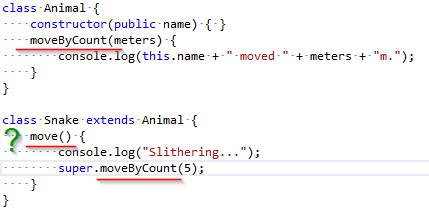

Setup:

1. Load something so we can easily get to `lib.d.ts`
2. Turn off Whitespace in Visual Studio
3. Turn off compile on save for TypeScript
4. Turn off 'auto load changes if saved'
5. Bump up fonts
6. Open http://www.typescriptlang.org/Playground/


TODO:

- manually download font? https://fonts.googleapis.com/css?family=Lato:400,700,400italic,700italic
- Search for other TODO's and fix
- Walk through converting an existing project to TypeScript

===

# TypeScript 
### Presented By
# Jason Jarrett
> * Twitter: [@staxmanade](https://twitter.com/staxmanade)
> * Blog: [http://elegantcode.com](http://elegantcode.com)
> * Some Code: [http://github.com/staxmanade](http://github.com/staxmanade)
> * Work at: [Vertigo](http://vertigo.com)

===

### TypeScript

# What?

==

## The Language

The below JavaScript

    function log(value) {
        console.log(value);
    }
    
    log("Hello World");

is also TypeScript

Note:
- It's just JavaScript - sort of -(Superset)
- ES6
- Static annotations

===

### TypeScript

# Why?

Note:
- Difficult to structure JavaScript at scale.
- Prevalence of JavaScript
- Catches a class of bugs earlier

==

# subtle bug(s)

> can you see the error(s) here?

    function myLog(value: string) {
        alert(value);
    }
    
    mylog(["Hello World"]);

==
> can you see the error(s) here?

    function myLog(value: string) {
        alert(value);
    }
    
    mylog(["Hello World"]);

compile and we get

    Compile Error. 

    ScratchTypeScript.ts(5,1): 
        error TS2095: Could not find symbol 'mylog'.

==

## next bug

> can you see the error here?

    function myLog(value: string) {
        console.log(value);
    }
    
    myLog(["Hello World"]);

==

# Error 2


> can you see the error here?

    function myLog(value: string) {
        console.log(value);
    }
    
    myLog(["Hello World"]);

compile and we get

    Compile Error. 

    ScratchTypeScript.ts(5,1):
        error TS2081: Supplied parameters do not match 
                      any signature of call target.

    ScratchTypeScript.ts(5,1): 
        error TS2087: Could not select overload 
                      for 'call' expression.

==

Now that all our errors are removed

    function myLog(value: string) {
        console.log(value);
    }
    
    myLog("Hello World");

==

Now that all our errors are removed

    function myLog(value: string) {
        console.log(value);
    }
    
    myLog("Hello World");

compile and we get

    function myLog(value) {
        console.log(value);
    }

    myLog("Hello World");

===

### TypeScript

# Who?

Note:
- Built by Microsoft (built out in the open)
    - Haven't seen them take a pull-request
    - But are pretty good to respond to Issues reported.
- Open Source (Apache License 2.0)
- Led by Anders Hejlsberg (Lead Architect of C#)
    - As of 8/26 - he's only made 2 commits to the source code and they for spec documentation

==

# Who else?

- [DefinitelyTyped](http://github.com/DefinitelyTyped) (OSS)
    - `NuGet` and `tsd`

Note:
- TypeScript in place of w3c language
- DefinitelyTyped
- Forks of TypeScript on GitHub

===

### TypeScript

# Where?

Anywhere you write JavaScript (almost)

===

### TypeScript

# How?

Note:
- IDE's
- Build tools (command line, C.I.)

==

## Install

- Visual Studio Extension

or

`node install -g typescript`

### Compiler

    :> tsc [options] [file ..]


Some Examples

    :> tsc hello.ts
    :> tsc --out foo.js foo.ts
    :> tsc @args.txt

Note:

- command line `tsc`
- compiler is a `.js` file
- can be leveraged by 3rd party tooling

==

# some options

      -d, --declaration             Generates corresponding .d.ts file
      -m KIND, --module KIND        Specify module code generation: "commonjs" or "amd"
      --noImplicitAny               Warn on expressions and declarations with an implied 'any' type.
      --sourcemap                   Generates corresponding .map file
      -t VERSION, --target VERSION  Specify ECMAScript target version: "ES3" (default), or "ES5"
      @<file>                       Insert command line options and files from a file.

... there are more than listed above ...
==

# Editors

- many choices
- early but each is getting better

==

# Visual Studio.

> Of course

==

### Intellisense


==

### In-line errors detected


==

### Refactoring (Rename)




==

### Web Essentials Extension


==

# JetBrains WebStorm 6

All the greatness of JetBrains for TypeScript


==

# Browser

[TypeScriptLang.org](http://typescriptlang.org)


==

# Vim

Vim (github: [typescript-vim](https://github.com/leafgarland/typescript-vim))


Note:
TODO: https://github.com/clausreinke/typescript-tools

==

# Other editors

- Cloud 9
- Eclipse (github: [eclipse-typescript](https://github.com/palantir/eclipse-typescript))
- Emacs
- Sublime
- [CATS](http://jbaron.github.io/cats/) Code Assistant for TypeScript
- Notepad <- wait what :P

===

# Componentization

1. Modules
2. Classes
3. Interfaces

==

## Modules

    module Zoo {
        export function getAnimalCount() {
            return 243;
        }
    }
Compiles to:

    var Zoo;
    (function (Zoo) {
        function getAnimalCount() {
            return 243;
        }
        Zoo.getAnimalCount = getAnimalCount;
    })(Zoo || (Zoo = {}));

==

## Classes

    class Animal {
        constructor(public name) { }
        move(meters) {
            console.log(this.name + " moved " + meters + "m.");
        }
    }

Compiles to:

    var Animal = (function () {
        function Animal(name) {
            this.name = name;
        }
        Animal.prototype.move = function (meters) {
            console.log(this.name + " moved " + meters + "m.");
        };
        return Animal;
    })();

==

## Interfaces

    interface ZooTime {
        hours: number;
        minutes: number;
    }
    
    interface Zoo {
        openTime() : ZooTime;
    }
Compiles to:

    /* 
     * nothing - interfaces striped away during compilation
     * only used during static verification
     */

===

# Bits of the Language

==

How to reference another TypeScript file?

    /// <reference path="someDependency.ts" />
    var myClass = new someDependency.someClass();

or

==

    import someDependency = module('Dependency');
    var myClass = new someDependency.someClass();

<br>

The above can work with either `CommonJS` like `RequireJS` or `AMD` used by `nodejs`

==
## Type annotations


==

## Arrow Functions

==

## Optional Parameters?

    function optional(name: string, age?: number) {
        return "Name: " + name + " Age: " + age;
    }

    optional("hi");
    optional("hi", 1);

compiles to

    function optional(name, age) {
        return "Name: " + name + " Age: " + age;
    }

    optional("hi");
    optional("hi", 1);

==

## Default Parameters

    function defaultParameter(name: string = 'myDefaultValue') {
        return name;
    }

compiles to

    function defaultParameter(name) {
        if (typeof name === "undefined") { name = 'myDefaultValue'; }
        return name;
    }

==

## Overloads

    function overloadedMethod(input: string);
    function overloadedMethod(input: number);
    function overloadedMethod(input: any) {
        return input.toString();
    }

==

## Enumerations

    enum MyEnum {
        Value1,
        Value2,
        Value3
    }

compiles to

    var MyEnum;
    (function (MyEnum) {
        MyEnum[MyEnum["Value1"] = 0] = "Value1";
        MyEnum[MyEnum["Value2"] = 1] = "Value2";
        MyEnum[MyEnum["Value3"] = 2] = "Value3";
    })(MyEnum || (MyEnum = {}));

==

## Enum sample 2

    enum MyOtherEnum {
        Value1 = 3,
        Value2 = 5,
        Value3 = 8
    }

compiles to

    var MyOtherEnum;
    (function (MyOtherEnum) {
        MyOtherEnum[MyOtherEnum["Value1"] = 3] = "Value1";
        MyOtherEnum[MyOtherEnum["Value2"] = 5] = "Value2";
        MyOtherEnum[MyOtherEnum["Value3"] = 8] = "Value3";
    })(MyOtherEnum || (MyOtherEnum = {}));

==

## Structural Typing

    class ClassA {
        SomeMethod(name: string) {
            return name;
        }
    }

    var SpecialC = function () {
        this.SomeMethod = function (name: string) {
            return name;
        }
    }

    var proof: ClassA = new SpecialC();

==

## Ambient Declarations

angry tsc

    document.title = "Hello";

error TS2095: Could not find symbol 'document'.

happy tsc

    declare var document;
    document.title = "Hello";
==

Note:
TODO: 

## Access modifiers

## Generics with type constraints

## Exceptions & custom errors

## Rest Parameter

```
    restParameter(...name: string[]) {
        return name.toString();
    }
```

==

# lib.d.ts

Note:
- show it in V.S.

===

# Let's go play with the language

Note:
- Visual Studio
- Set TypeScript to compile on save
- Set document refresh options

==

# Convert an existing project to TypeScript?

# Rename files from javascript to typescript
ls *.js -Recurse | %{ mv $_ ($_.FullName.trimEnd("js") + "ts") }

- Add typescript to the build
- run 'grunt'

 - npm install -g tsd

.\d.ts\DefinitelyTyped\node\node.d.ts

- Put the references.ts path into the root of each file.
$projectRoot = (pwd).path;
ls .\lib\* -exclude references.ts -Include *.ts -Recurse | %{ $subCount = ($_.Directory.FullName).replace($projectRoot + '\', '').split('\').length-1; $file = cat $_; sc $_ -value ("///<reference path='" + ("../" * $subCount) + "references.ts' />`n"), $file }

- fixup the static declaration method on FileApprover.ts
- Found a possible bug in the lib/Providers/Mocha/Approvals.Mocha.ts (WTF?)
http://www.reactiongifs.com/wp-content/uploads/2011/09/mind_blown.gif


ZSH on mac.
for i in ./**/*.js ; do mv $i ${i:r}.ts ; done

tsc Approvals.js

npm install tsd -g


TODO: figure out powershell version
ls * -recur -include *.js | %{ mv $_ (


The language syntax

Some typescript features

tsc (compiler) (review some command line options)
